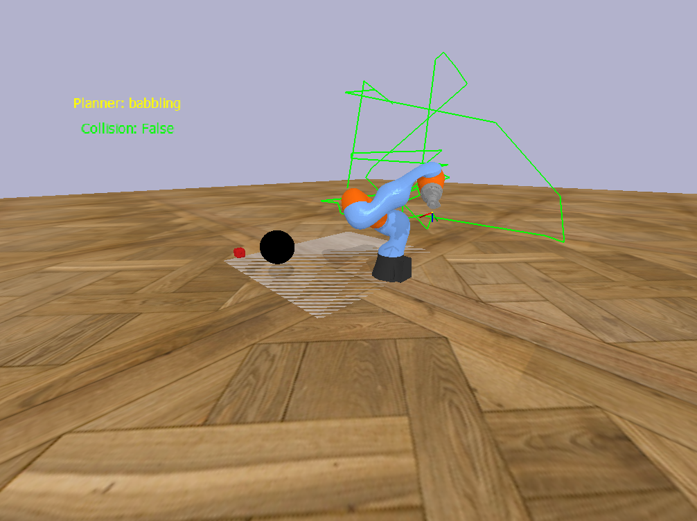
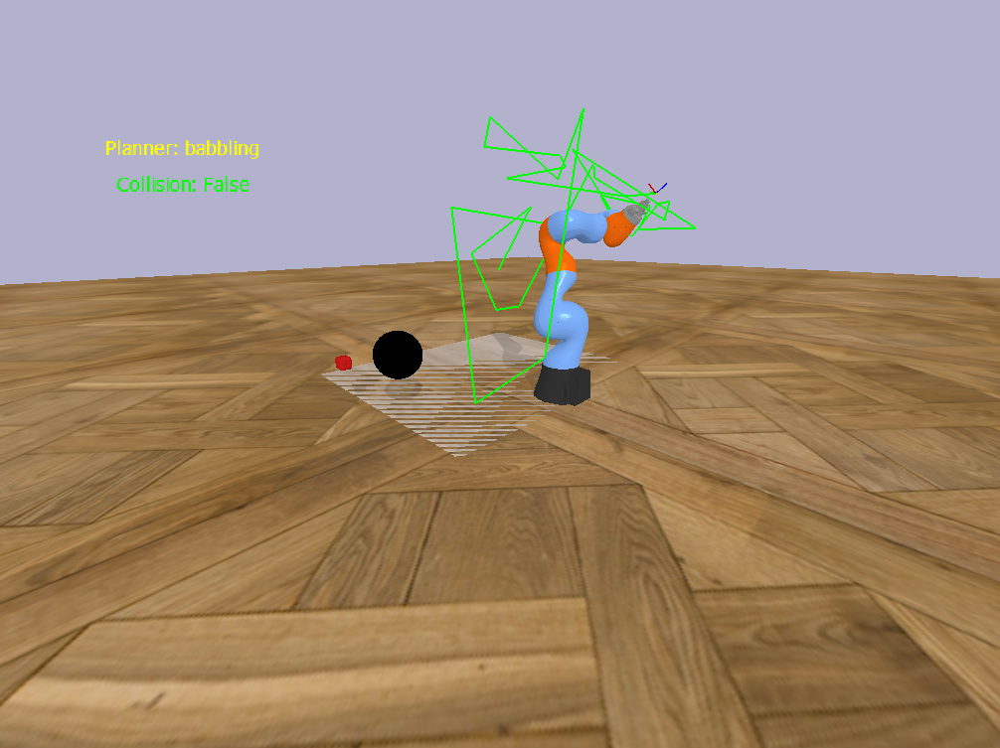
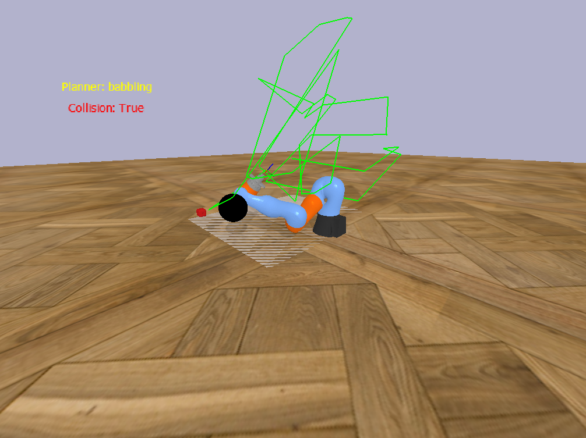
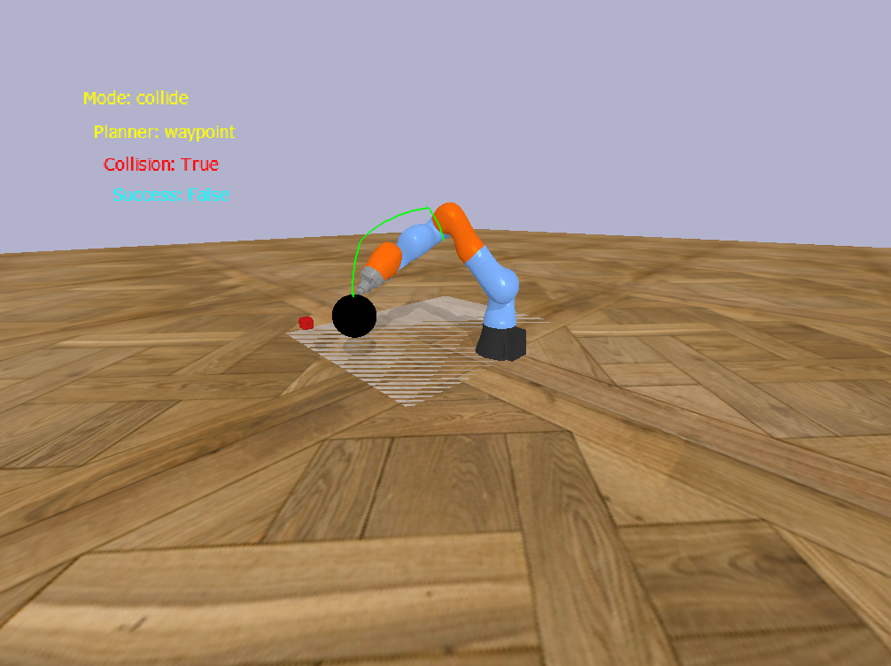
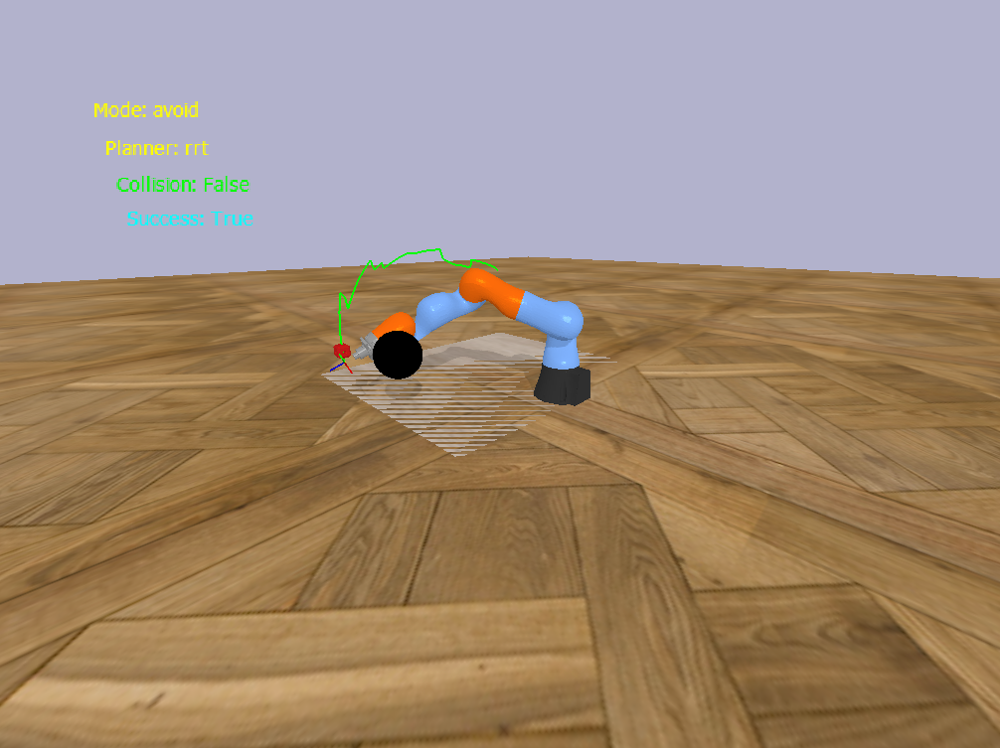
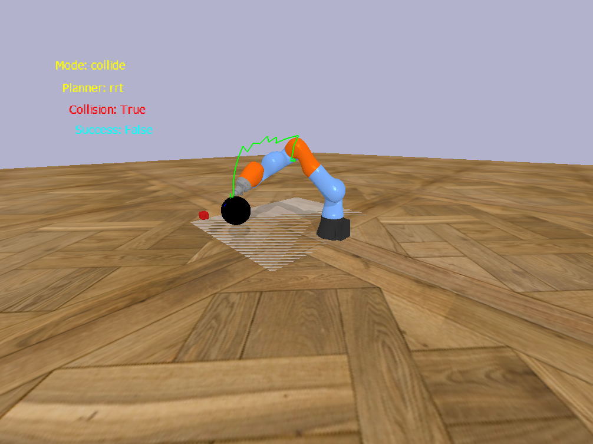
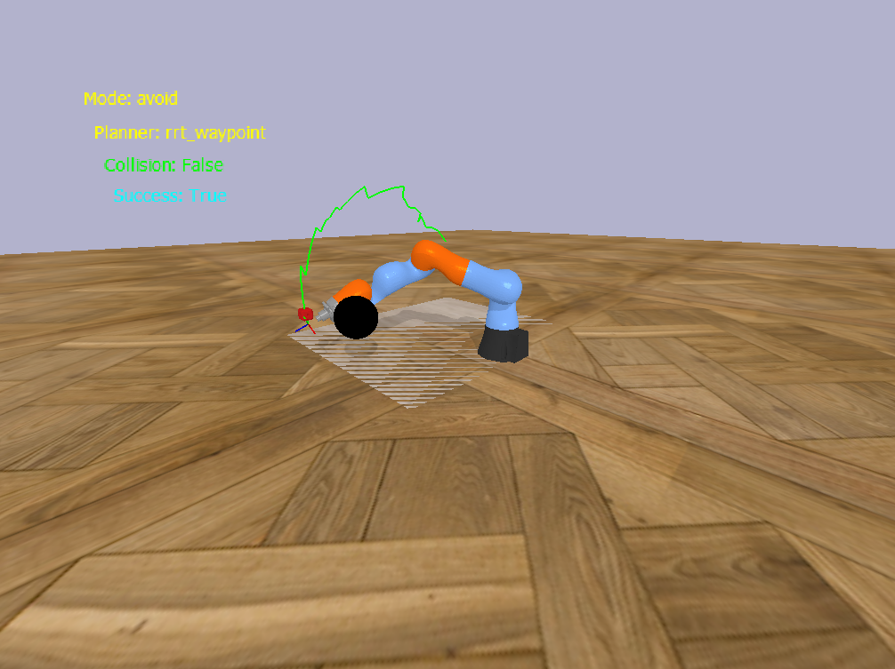
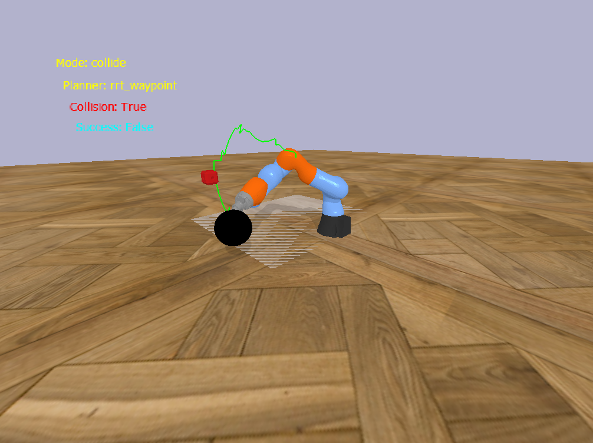

# Dataset generator for Bachelor's thesis

A tool using MyGym environment to generated structured data for training FM/IM neural 
network architecture.

## Overview

This project provides a data generator used to create training inputs for bio-inspired
FM/IM neural architecture.
**What it includes:**
- Wrapper for MyGym gym environment,
- Data generation scripts,
- Various trajectory generators using different approaches providing policies,
- Visualized example samples of generated outputs,
- Documentation of how the generator works internally, specifically how it plans trajectories.

## Folder structure
```
project/
├── configs/ # configurations for env
│    └── dataset_gen.json
├── helpers/ # helper methods for trajectory planning
│    └── geometry_helper.json
├── screenshots/
├── math/ # deeper explanation of planning algorithms
│   ├── rrt_planner.md
│   └── waypoint_planner.md
├── policies/ # various approaches to generating trajectories
│   ├── babbling_policy.py
│   ├── rrt_policy.py
│   └── waypoint_policy.py
├── screenshots/ # visual examples of data samples
├── dataset_generator.txt # utilizes planners to generate data
├── wrapper.py # Wrapper of MyGym env used for generation
└── README.md
```

## High-level logic overview
Brief explanation of the logic:
- Input parameters - config of the environment,
- Trajectory planners - motor babbling, analytical calculation of waypoints, Rapidly-exploring Random Trees, combination, etc., 
- Data produced - episode represented as a sequence of (current state, action, next state, collision flag for the step),
and additional information (chosen planner and its mode for the episode, collision flag for the episode),
- Constraints or assumptions - currently only works with a single spherical occlusion, and mode of the planner does not predict
necessarily whether the episode contains collision or not

## Visualized data samples in sim

### Motor babbling





### Detour and impact waypoints




### Rapidly-exploring Random Trees




### RRT + Waypoints





## (possible) TODO
- [ ] Offer more customization for the generator through config,
- [ ] Allow more randomization in both colliding and avoiding trajectories generated with RRT algorithms,
- [ ] Approximate workspace of the robot - where a goal object can be placed and in which orientation gripper grabs it,
- [ ] Add other options for occlusions,
- [ ] Separate the planning, generating and data processing into individual classes (instead of only DatasetGenerator),
- [ ] Finish data processing part by adding a permanent storage of produced episode observations,
- [ ] Smooth out RRT curves,
- [ ] Make trajectory generation more stable,

## License
For academic use